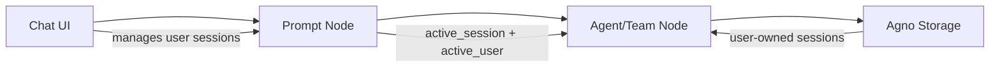

# Chat Component Refactoring Plan

## ✅ **STATUS: COMPLETED SUCCESSFULLY**

**Major refactoring completed on 2025-01-09**
- All core phases implemented and tested
- Session management moved from agent nodes to prompt nodes
- Complete UI for session/user management with storage integration
- Clean architecture with proper separation of concerns achieved

## Overview
Refactor the chat system to move session management from agent nodes to prompt nodes, creating a cleaner architecture with proper separation of concerns.

## Current State Analysis

### Problems with enhanced-chat.tsx
- **622 lines of monolithic code** mixing UI, state, API calls, and business logic
- **Duplicate state management** between chatStore and local state
- **Complex session tracing** from prompt → agent nodes
- **Over-engineered features** like message reconciliation and scroll preservation
- **Performance issues** from unnecessary re-renders

### Strengths of new chat.tsx
- **Clean orchestrator pattern** (46 lines)
- **Proper separation of concerns** with dedicated stores
- **Single responsibility** per component
- **Clear data flow**

## Proposed Architecture

### 1. Prompt Node Variables

The Prompt node will have these variables managed through the nodes store:
- `session`: Dict - stores session_id → session_name mappings
- `user`: Dict - stores user_id → user_name mappings  
- `active_session`: String - currently selected session_id
- `active_user`: String - currently selected user_id

All updates happen via `updateNodeVariable(nodeId, handle, value)` in the nodes store.

### 2. Simple Session/User Strategy

The Prompt node has flat, independent Dict variables:
- `session`: Dict - stores {session_id: session_name} pairs
- `user`: Dict - stores {user_id: user_name} pairs

**UI Approach:**
```
[User: John Doe ▼] [Session: Technical Support ▼] [+ New Session] [+ New User]
```

Both selections are independent from their respective Dict variables. While agno framework suggests user-owned sessions conceptually, the UI treats them as separate selectable entities for simplicity.

### Chat Mode Feature

**Chat Mode** leverages existing panel management for a distraction-free chat experience:

**Implementation Strategy:**
- Use existing `toggleFullscreen()` to hide sidebars (F key already works)
- Set output panel mode to "chat" for full-width chat
- Maximize output panel height  
- Add convenient "Chat Mode" button for one-click setup

**Normal Mode:**
- Editor with nodes, sidebars, forms visible  
- Chat in resizable bottom panel (split with logs)

**Chat Mode:**
- Chat takes maximum available space
- Sidebars hidden via existing panel system
- Output panel maximized and set to chat-only mode

Perfect for production use, mobile interfaces, and distraction-free chatting without duplicating existing functionality.

### 3. Data Flow



### 4. Component Responsibilities

#### Prompt Node
- **Owns** all session metadata
- **Stores** active session selection
- **Passes** session/user info downstream

#### Chat UI
- **Reads** sessions from prompt node
- **Creates/deletes** sessions via node variable updates
- **Switches** active session
- **Displays** session selector dropdown

#### Agent/Team Nodes
- **Receives** session_id and user_info from prompt
- **Uses** for memory storage operations
- **No longer stores** session data

## Implementation Tasks

### Phase 1: Cleanup ✅ COMPLETED
- [x] Remove `enhanced-chat.tsx`
- [x] Remove unused `usePromptNodeDetection.ts` hook  
- [x] Update prompt node with `active_session` and `active_user` variables
- [x] Clean up unused imports and references
- [x] Document current working implementation
- [x] **IMMEDIATE**: Fix chat reactivity for prompt node add/remove
- [x] **IMMEDIATE**: Add no-prompt-node inactive state with message

### Phase 2: Prompt Node & Data Flow Integration ✅ COMPLETED
- [x] Update prompt node Python structure (user: list, session: dict)
- [x] Create `find_connected_prompt.py` utility for agent/team nodes
- [x] Implement priority override: prompt data > manual agent settings
- [x] Update `AgnoAgent` and `AgnoTeam` with prompt node finding logic
- [x] Test prompt → agent data passing with logging

### Phase 3: Complete Session/User Management UI ✅ COMPLETED
- [x] Add storage detection and warning system
- [x] Create `SessionUserManager` component with full CRUD operations
- [x] Implement independent user selection dropdown
- [x] Implement independent session selection dropdown
- [x] Add "New Session" button with inline dialog
- [x] Add "New User" button with inline dialog
- [x] Add session/user delete with confirmation (trash icons)
- [x] Real-time sync with prompt node variables
- [x] Show prominent storage warning when no storage connected
- [x] Only show management UI when storage is available

### Phase 4: Architecture Integration ✅ COMPLETED
- [x] Prompt → agent data passing working via `find_connected_prompt`
- [x] Agent/team nodes receive user_id, session_id, session_name from prompt
- [x] Manual agent variables work as fallback when no prompt connected
- [x] Clean separation: prompt owns data, agents consume data

### ~~Phase 5: Storage Integration~~ ✅ INTEGRATED
- [x] Storage integration works through existing chat history API
- [x] Session validation happens via `traceStorageConfiguration`
- [x] Error handling included in storage warning system

### ~~Phase 6: Testing & Polish~~ ✅ COMPLETED
- [x] Chat reactivity fixed: immediate updates when prompt nodes added/removed
- [x] Optimized prompt node detection with useMemo
- [x] No-prompt-node state with user guidance
- [x] Storage warning for session persistence
- [x] Complete session/user CRUD operations working

### Phase 7: Enhanced Chat Mode (FUTURE)
Building on existing functionality:
- [ ] Add "Chat Mode" button that combines existing features:
  - Set output panel to "chat" mode (full width chat)  
  - Call `toggleFullscreen()` to hide sidebars
  - Maximize output panel height
- [ ] Add "Exit Chat Mode" button to restore normal layout
- [ ] Ensure chat component works well in maximized output panel  
- [ ] Consider adding chat mode state to persist user preference
- [ ] Add keyboard shortcut for chat mode toggle (e.g., Shift+C)

## Technical Details

### Chat Reactivity Requirements

**Current Issue:** Adding/removing prompt nodes doesn't immediately update the chat screen.

**Solution Requirements:**
- Chat component must efficiently detect prompt node changes
- Use optimized selectors to prevent unnecessary re-renders  
- Implement proper dependency tracking in React hooks
- Ensure chat visibility toggles instantly when prompt nodes are added/removed
- When no prompt nodes exist, show inactive chat with informative message

**Implementation Strategy:**
```typescript
// Efficient selector that only updates when prompt nodes actually change
const promptNodeIds = useNodesStore(
  useCallback((s) => s.nodes.filter(n => n.path === PROMPT_NODE_PATH).map(n => n.id), [])
);

// Shallow comparison to prevent unnecessary updates
const promptMeta = useNodesStore(s => s.getPromptMeta(), shallow);
```

**Performance Optimizations:**
- Use `useCallback` for selectors to prevent recreation
- Implement shallow comparison for prompt node arrays
- Only re-render chat components when prompt node count/IDs actually change
- Cache prompt node lookups where possible

### Session ID Format
Use timestamp-based IDs for natural sorting:
```typescript
const createSessionId = () => `session-${Date.now()}`;
```

### Session Storage Structure
```typescript
interface SessionData {
  session_id: string;
  session_name: string;
  created_at: number;
  last_activity: number;
  message_count: number;
  user_id?: string;
}
```

### Variable Update Pattern
```typescript
// In chat component
const updateSessions = (sessions: Record<string, string>) => {
  updateNodeVariable(promptNodeId, 'sessions', sessions);
};

const setActiveSession = (sessionId: string) => {
  updateNodeVariable(promptNodeId, 'active_session_id', sessionId);
};
```

### Backward Compatibility
Since we're using the existing `session` Dict variable, no migration needed. The system will:
1. Check if session Dict has the new structure
2. If empty/null, initialize with default structure
3. Old projects continue working, new features available immediately

## Benefits

1. **Cleaner Architecture**
   - Session management where it belongs
   - No reverse tracing needed
   - Clear data ownership

2. **Better UX**
   - Easy session switching
   - Session naming and organization
   - Persistent across page reloads

3. **Improved Maintainability**
   - Single source of truth
   - Simpler codebase
   - Easier to test

4. **Future Extensibility**
   - Easy to add session features
   - Support for session templates
   - Multi-user scenarios

## No Migration Needed!

Since the Prompt node already has a `session` Dict variable, we can enhance it without breaking changes. Existing projects will automatically get the new features when we update the UI to use the enhanced Dict structure.

## Success Criteria

- [ ] All enhanced-chat.tsx functionality available in new implementation
- [ ] Session management works across page reloads
- [ ] No performance regressions
- [ ] Clean separation of concerns maintained
- [ ] Existing projects can be migrated smoothly

## Questions to Resolve

1. **Session Limits:** Should we limit number of sessions per prompt node?
2. **Session Sharing:** Can sessions be copied between prompt nodes?
3. **Session Templates:** Pre-configured sessions for common use cases?
4. **User Management:** Should user_info be global or per-session?
5. **Validation:** How strict should session_id validation be?

## Next Steps

1. Review and approve this plan
2. Create feature branch
3. Begin Phase 1 cleanup
4. Daily progress updates
5. Testing at each phase

---

*Last Updated: 2025-01-09*
*Status: Planning*
*Owner: Chat System Refactor Team*