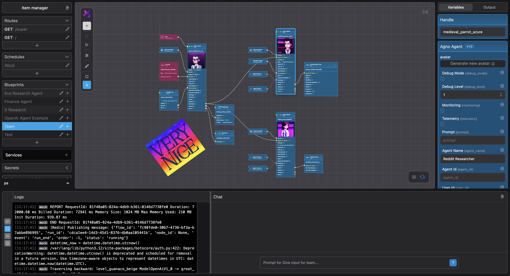

<p align="center">
  
</p>

# PolySynergy Portal

> 🚀 **Get Started**: This is part of the [PolySynergy Orchestrator](https://github.com/dionsnoeijen/polysynergy-orchestrator) - a visual workflow automation platform. Start there to set up the complete system and begin building AI agent workflows.

## Overview

The PolySynergy Portal is a sophisticated visual node-based workflow editor that enables users to create, manage, and execute complex data processing pipelines through an intuitive drag-and-drop interface. Built with Next.js and TypeScript, it provides real-time collaboration features, advanced canvas interactions, and seamless integration with various data sources and AI services.

<p align="center">
  
</p>

## Key Features

### Visual Workflow Editor
- **Node-based Interface**: Drag-and-drop nodes to build complex workflows
- **Real-time Canvas**: Powered by Konva.js for smooth, responsive interactions
- **Multi-layered Design**: Separate layers for nodes, connections, and annotations
- **Drawing Tools**: Built-in annotation and documentation capabilities

### Advanced Node Types
- **Prompt Nodes**: AI-powered text generation and processing
- **Data Processing Nodes**: Transform, filter, and manipulate data
- **API Integration Nodes**: Connect to external services and databases
- **Control Flow Nodes**: Conditional logic and flow control
- **Variable Management**: Dynamic variable binding and propagation

### Execution Engine
- **Local & Cloud Execution**: Run workflows locally or on AWS Lambda
- **Real-time Monitoring**: Live execution tracking with detailed logging
- **Variable Inspection**: Deep dive into node outputs and intermediate results
- **Execution History**: Persistent storage of workflow runs and results

### Collaborative Features
- **Multi-user Support**: Real-time collaboration on workflows
- **Version Control**: Built-in versioning and change tracking
- **Chat Integration**: Context-aware chat with AI assistants
- **Shared Workspaces**: Team-based project organization

### User Interface
- **Dark/Light Themes**: Adaptive UI with system preference detection
- **Responsive Design**: Works seamlessly across desktop and tablet devices
- **Keyboard Shortcuts**: Power-user features for efficient workflow creation
- **Contextual Menus**: Right-click actions and smart suggestions

## Architecture

### Frontend Stack
- **Next.js 14**: React framework with App Router
- **TypeScript**: Type-safe development with strict mode
- **Tailwind CSS**: Utility-first styling with custom design system
- **Zustand**: Lightweight state management
- **Konva.js**: 2D canvas library for high-performance graphics

### Backend Integration
- **WebSocket**: Real-time communication for live updates
- **REST API**: Standard HTTP endpoints for data operations
- **DynamoDB**: Scalable NoSQL database for execution data
- **Redis**: In-memory caching and pub/sub messaging
- **AWS Lambda**: Serverless execution environment

### Development Tools
- **ESLint**: Code linting with custom rules
- **Prettier**: Code formatting and style consistency
- **Husky**: Git hooks for quality assurance
- **TypeScript Strict Mode**: Enhanced type checking

## Project Structure

```
src/
├── components/          # React components
│   ├── editor/         # Main editor interface
│   │   ├── canvas/     # Canvas and node rendering
│   │   ├── sidebars/   # Left and right panels
│   │   ├── bottombars/ # Bottom panels and chat
│   │   └── drawing/    # Annotation and drawing tools
│   ├── forms/          # Configuration forms
│   └── ui/             # Reusable UI components
├── stores/             # Zustand state stores
├── hooks/              # Custom React hooks
├── types/              # TypeScript type definitions
├── utils/              # Utility functions
└── app/                # Next.js app router pages
```

## Key Components

### Editor Layout
The main editor interface consists of multiple panels:
- **Left Sidebar**: Node library, route manager, and project navigation
- **Canvas**: Main workspace for building workflows
- **Right Dock**: Variable inspector and execution output
- **Bottom Panel**: Logs, chat, and execution monitoring

### Node System
Nodes are the building blocks of workflows:
- Each node has inputs, outputs, and configurable properties
- Nodes communicate through typed connections
- Variables flow through the graph automatically
- Execution happens in topological order

### State Management
The application uses multiple Zustand stores:
- `editorStore`: Canvas state, selection, and UI modes
- `nodesStore`: Node data, connections, and variables
- `executionStore`: Workflow execution and monitoring
- `chatStore`: AI chat integration and history

## Execution Modes

### Development Mode
- Full UI interaction enabled
- Real-time variable inspection
- Interactive debugging capabilities
- Manual execution control

### Execution Mode
- Streamlined interface during workflow runs
- Disabled node selection and editing
- Automatic output panel activation
- Live log streaming

## Integration

This project is designed as a submodule of the [PolySynergy Orchestrator](https://github.com/dionsnoeijen/polysynergy-orchestrator), which handles:
- Environment setup and configuration
- Backend service orchestration
- Authentication and user management
- Deployment and scaling

## Technology Highlights

### Canvas Rendering
- Hardware-accelerated graphics via Konva.js
- Smooth zoom and pan interactions
- Layer-based rendering for optimal performance
- Custom node shapes and connection styles

### Real-time Features
- WebSocket-based live updates
- Collaborative cursor tracking
- Instant variable propagation
- Live execution monitoring

---

<p align="center">
  Part of the <a href="https://github.com/dionsnoeijen/polysynergy-orchestrator">PolySynergy Orchestrator</a> ecosystem
</p>